# Jtagulator 硬件调试器使用手册

## 0x00 前言

Jtagulator 是由安全研究员 Joe Grand 设计并开源的一款多合一硬件调试工具。它集成了 **接口自动识别**、**逻辑分析仪** 和 **芯片编程/调试** 三大核心功能，特别适用于硬件逆向工程、嵌入式安全测试和固件提取等场景。

该设备完全开源，相关设计文件、固件源码及使用说明可在其官网获取：
- 官方主页：http://www.grandideastudio.com/jtagulator/
- GitHub 仓库：https://github.com/grandideastudio/jtagulator
- 由我制作的增强固件：https://github.com/Chaoschaos1024/jtagulator-ID-Tracker
- 查看中文教程：https://space.bilibili.com/39602674

---

## 0x01 固件更新

### 1. 准备烧录环境
1.  下载并安装 Propeller 开发工具：
    - 下载链接：http://www.grandideastudio.com/wp-content/uploads/P8X32A-Setup-Propeller-Tool-v1.3.2.zip
	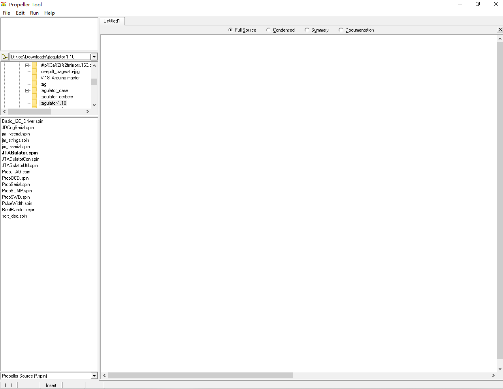
2.  从 GitHub 仓库下载 Jtagulator 固件源码：
    - 访问 https://github.com/grandideastudio/jtagulator
	或者增强版本：https://github.com/Chaoschaos1024/jtagulator-ID-Tracker
	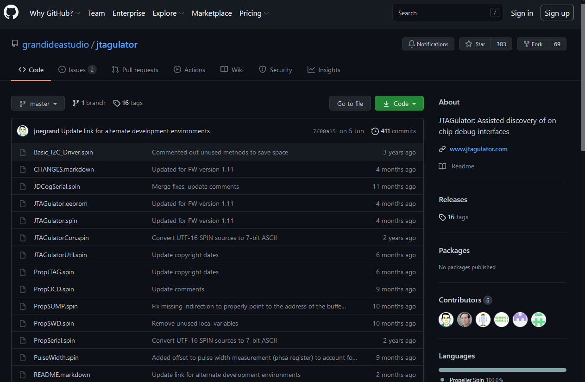
    - 在右侧栏点击 **Releases** 进入发布页面，选择最新版本（或所需版本）的固件压缩包下载并解压。
	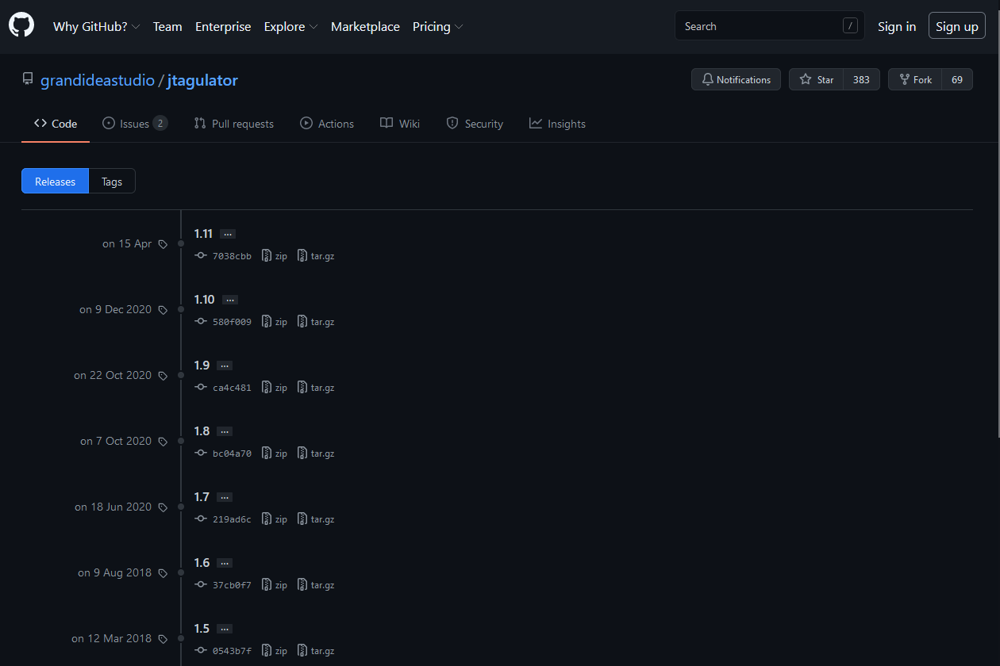
### 2. 编译与烧录步骤
1.  打开 Propeller Tool 软件，通过菜单栏 `File` -> `Open` 加载解压后文件夹中的 `JTAGulator.spin` 文件。
2.  在软件左侧的文件列表中，右键点击 `JTAGulator.spin` 文件，选择 `Set Top Object File` 将其设为主文件（文件名会变为粗体）。
	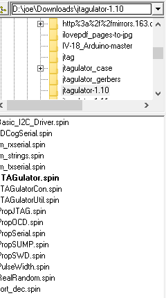
3.  将 Jtagulator 通过 USB 线连接至电脑。
4.  按下 **F7** 键，软件将自动检测连接的设备。若识别成功，按下 **Ctrl + F11** 开始烧录固件。
	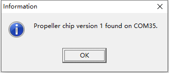
	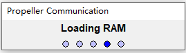

### 3. 增强功能固件（可选）
> 截至2025年11月，原版固件已两年半未更新。为提升使用体验，本人开发了一个增强版固件，主要添加了基于扫描得到的IDCODE反推芯片制造商的功能。

- **项目地址**：https://github.com/Chaoschaos1024/jtagulator-ID-Tracker
- **主要特性**：
    - 在 JTAG 或 SWD 接口扫描成功后，可自动显示芯片所属公司。
    - 内置包含1900余家厂商ID的数据库。

#### 数据库烧录（一次性操作）
增强功能需要将厂商数据库写入 Jtagulator 的 EEPROM 中。
1.  在 `jtagulator-ID-Tracker` 项目的 `eepromupdate` 文件夹下，将 `EEPROM_Update.spin` 设置为 Top Object File。
2.  按下 **F11** 将此烧录程序编译并烧录到 Jtagulator。
3.  使用串口终端连接 Jtagulator，程序将自动运行，依次执行 **清空EEPROM -> 写入数据库 -> 校验数据** 三个步骤，全程约需20分钟。
4.  烧录成功后，重新烧录主固件 `JTAGulator-ID-Tracker.spin` 即可启用增强功能。

> **注意**：数据库烧录为一次性操作，成功后无需重复。之后可随意烧录不同版本的固件，增强功能在刷回本固件后依然有效。
> **PS**：很欢迎各位来给这个项目点star。

---

## 0x02 设备连接与配置

### 硬件接口
Jtagulator 提供以下物理接口：
- **24个通用I/O通道**：通过三组 2.54mm 间距排针引出。
- **GND引脚**：用于共地连接。
- **VADJ引脚**：可调输出电平（1.4V - 3.3V），用于设定I/O通信电压。
- **USB接口**：Mini USB 型，用于供电和串口通信。

### 与电脑连接
设备连接电脑后，通常会被识别为一个虚拟串口（CDC设备）。驱动通常在主流操作系统（Windows, Linux, macOS）上可自动安装。
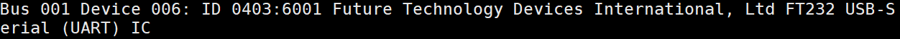

#### Windows 平台推荐（Xshell）
1.  从官网 https://www.netsarang.com/zh/xshell/ 下载并安装 Xshell（免费用于家庭/学校）。
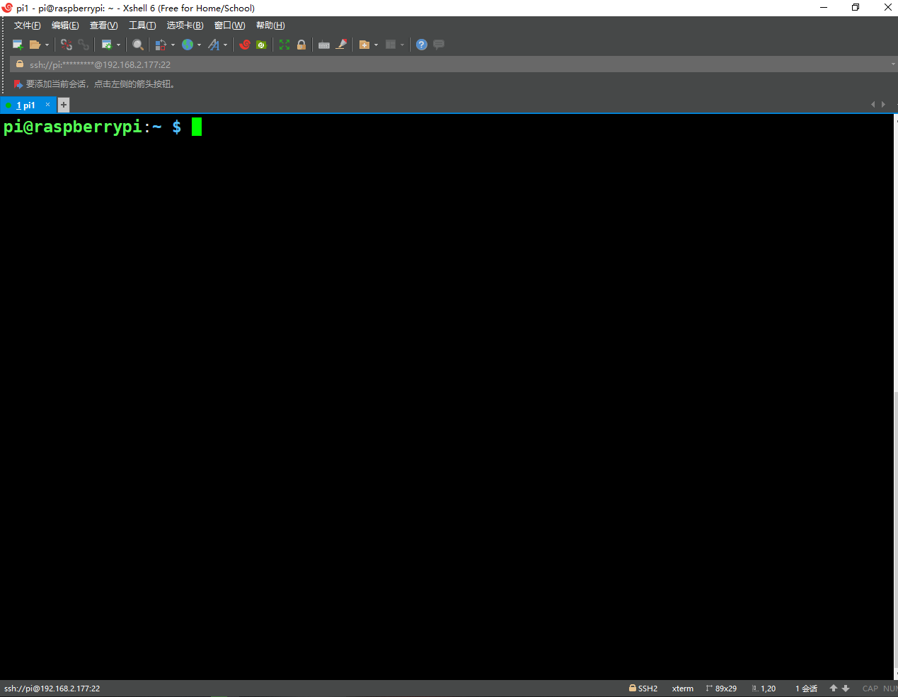
2.  新建会话：协议选择 **Serial**。
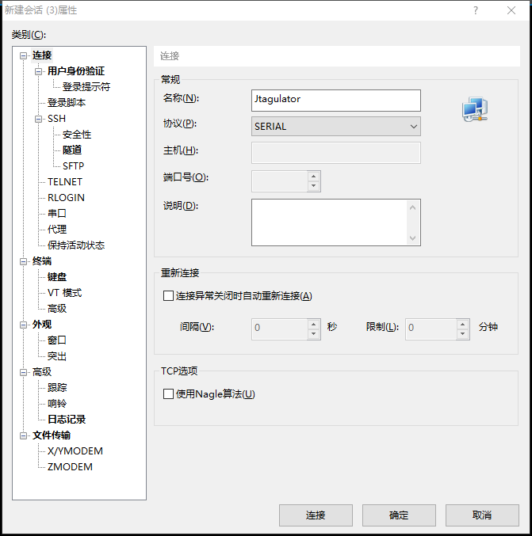
3.  设置串口参数：
    - 端口：根据设备管理器中的COM口号选择（如 `COM3`）。
    - 波特率：`115200`
    - 数据位：`8`
    - 停止位：`1`
    - 校验位：`None`
    - 流控：`None`
	
	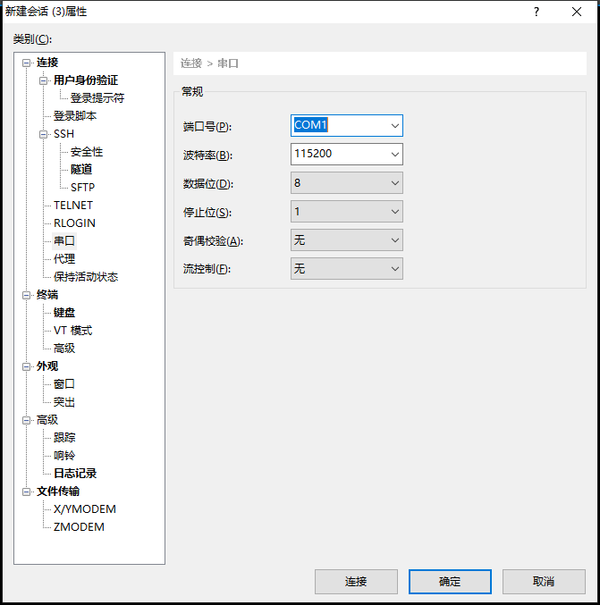
4.  连接后，按回车键即可看到 Jtagulator 的字符画启动界面。
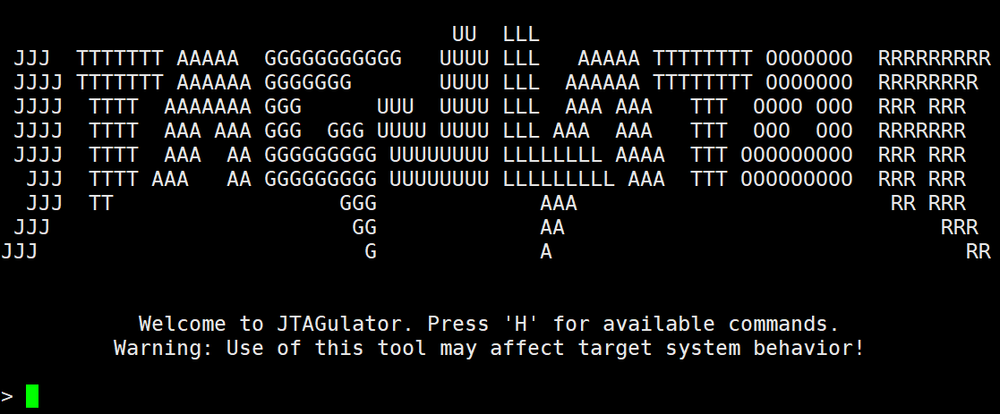

#### Linux 平台推荐（picocom）
```bash
# 安装 picocom（Debian/Ubuntu）
sudo apt install picocom

# 连接设备（通常为 /dev/ttyUSB0 或 /dev/ttyACM0）
picocom -b 115200 /dev/ttyUSB0
```
连接后若未显示字符界面，按回车键即可。
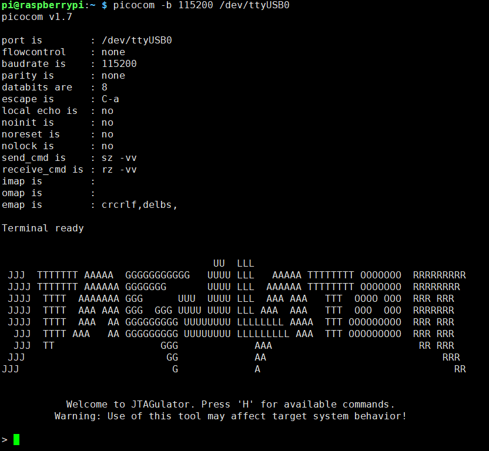

> **提示**：一种高效的用法是在树莓派等Linux设备上接入Jtagulator，然后通过SSH（如使用Xshell）远程操作，可简化软件配置流程。

---

## 0x03 连接目标板的安全须知

在对未知设备进行调试前，必须进行必要的安全检查，以防损坏设备。

1.  **确定地线（GND）**：
    - 使用万用表的通断档，在目标板上寻找与已知地（如电源接口负极、USB外壳、电容负极）直连的测试点。
    - 将 Jtagulator 的 GND 与目标板的 GND 可靠连接。

2.  **确定通信电平**：
    - **最佳方法**：使用示波器观察疑似通信引脚（如TX、TCK）的电压幅值。
    - **注意事项**：万用表测量的是平均电压，对于数字通信信号（如50%占空比的时钟）会显示为中间值（如1.65V对于3.3V信号），容易误判。
    - Jtagulator 的 I/O 口通过串联电阻和TVS二极管进行保护，可承受一定范围的过压，但为安全起见，建议先通过电平转换或分压等方式匹配电平。

3.  **关于 VADJ 引脚**：
    - VADJ 用于设置 Jtagulator I/O 口的高电平电压（输入阈值也随之变化）。
    - 程序提示不建议外接负载。在实际使用中，需要将其设置为与目标板通信电平一致（如3.3V，1.8V），实际看原理图的话，最多外接150ma。
	
    - **重要发现**：经测试，即使将 VADJ 设置为 3.3V，Jtagulator 的 I/O 口也能安全地 **耐受并识别 5V TTL 电平的输入信号**。这大大扩展了其使用范围。

---

## 0x04 基本操作与指令概览

通过串口终端连接后，输入 `h` 或 `H` 可查看帮助信息。

### 通用指令（在任何模式下均可使用）
- **`V`**：设置 I/O 通信参考电压（1.4V - 3.3V）。**开始任何操作前应先执行此指令**。
- **`I`**：显示当前固件版本信息。
- **`J`**：进入 **JTAG 接口嗅探与交互** 模式。
- **`U`**：进入 **UART（串口）嗅探与交互** 模式。
- **`G`**：进入 **GPIO 通用输入输出与逻辑分析仪** 模式。
- **`S`**：进入 **SWD 接口嗅探** 模式。
- **`Ctrl+X`**：**强制退出逻辑分析仪或者openocd模式**，返回主命令界面。当设备无响应时，可尝试此操作。

---

## 0x05 GPIO 模式详解

输入 `G` 进入 GPIO 模式，再次输入 `H` 查看该模式下的专用指令。
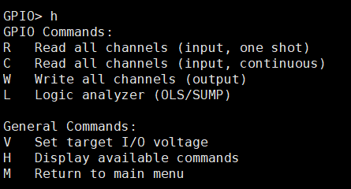

### 专用指令
1.  **`R` - 单次读取**
    - 读取所有24个通道的当前电平状态，并以二进制和十六进制格式显示。
	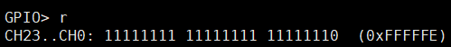
    - **注意**：Jtagulator 的 I/O 口内部被上拉，未连接时显示为高电平（1）。

2.  **`C` - 持续监视**
    - 持续读取所有通道电平，任何变化都会实时刷新显示。
	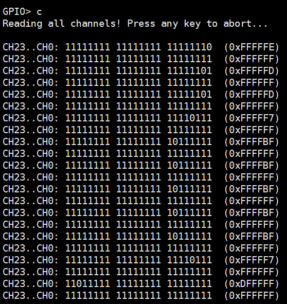
    - 按任意键退出监视模式。

3.  **`W` - 写入输出**
    - 向指定通道输出高低电平。
    - 需要输入一个6位的十六进制数（如 `FFFFFF`），对应24个通道（24 bits）。从最低位（bit 0）对应 CH0，最高位（bit 23）对应 CH23。
	
	   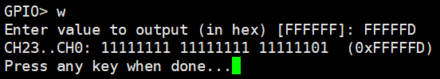
    - **示例**：欲使 CH2 输出低电平（0），其余为高电平（1），则二进制为 `11111111 11111111 11111011`，转换为十六进制为 `FFFFFB`。

4.  **`L` - 逻辑分析仪模式**
    - 将 Jtagulator 变为一个24通道的逻辑分析仪。
    - **退出**：在终端中输入 `Ctrl+X`。
    - **上位机软件**：推荐使用 **PulseView**。
        - **Linux 下配置**：
            1.  启动 PulseView：`pulseview -D`
            2.  选择驱动：`Demo Device` -> `Openbench Logic Sniffer & SUMP compatible (ols)`
            3.  选择端口：Jtagulator 对应的串口（如 `/dev/ttyUSB0`），波特率 `115200`。
            4.  点击 `Scan for devices using the driver above`，应识别出 `JTAGulator with 24 channels`。
		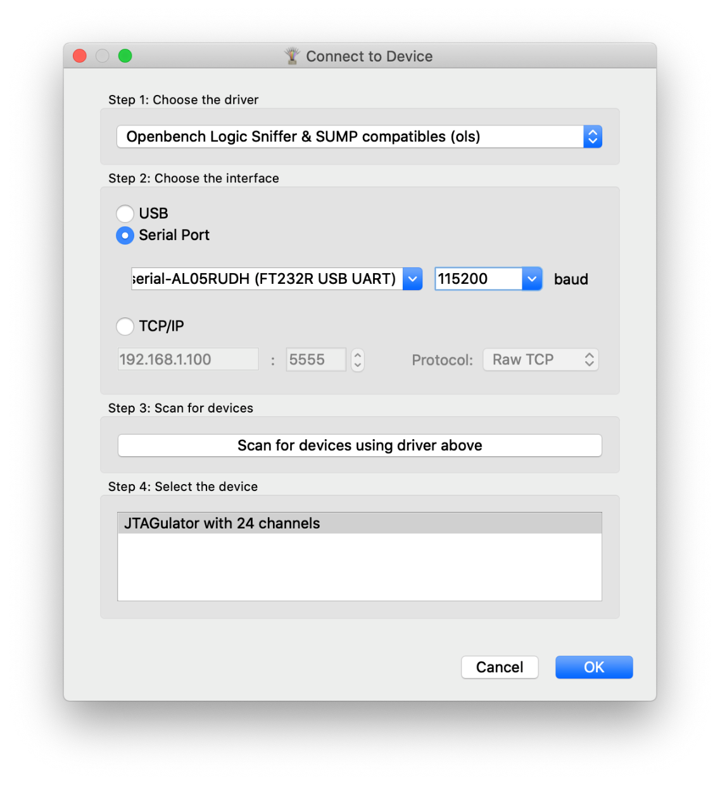
        - **注意**：由于设备内部缓冲区有限，此模式适合捕捉低频或短时突发信号，用于初步判断引脚活动。

---

## 0x06 JTAG 接口嗅探与调试

JTAG（IEEE 1149.1）标准最初用于边界扫描测试（Boundary Scan Test, BST），现已广泛用于芯片调试、编程和逆向工程。其核心是一个由 **TMS** 信号控制的状态机，通过 **TCK** 时钟同步，在 **TDI** 和 **TDO** 线上进行数据交换。可选信号 **TRST#** 用于异步复位JTAG状态机。

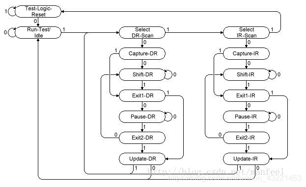

输入 `J` 进入 JTAG 模式，输入 `H` 查看指令。

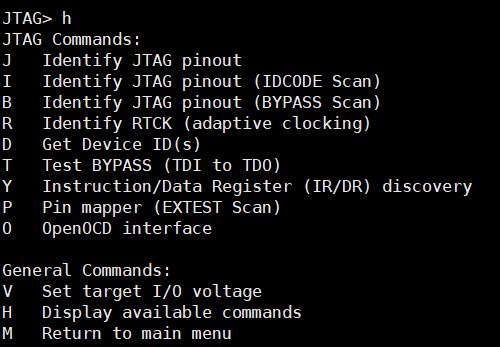

### 扫描指令详解
1.  **`J` - 基础 JTAG 扫描**
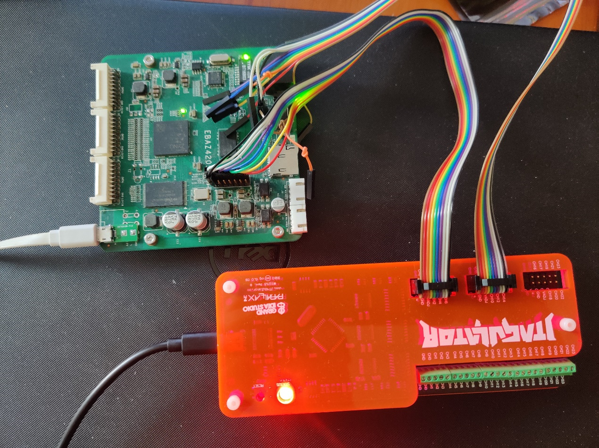

	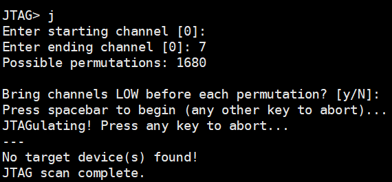
    - 最通用的扫描方法，通过穷举可能的引脚排列组合，尝试建立 JTAG 通信。
    - 操作流程：
        1.  设置开始通道和结束通道（建议将目标板引脚集中连接到连续的通道上，以减少组合数）。
        2.  选择是否在每次尝试前将通道置低（建议 **启用**，以复位可能存在的 TRST# 信号）。
    - 本质是发送一系列 JTAG 指令序列，观察 TDO 是否有符合预期的响应。

2.  **`I` - IDCODE 扫描**
	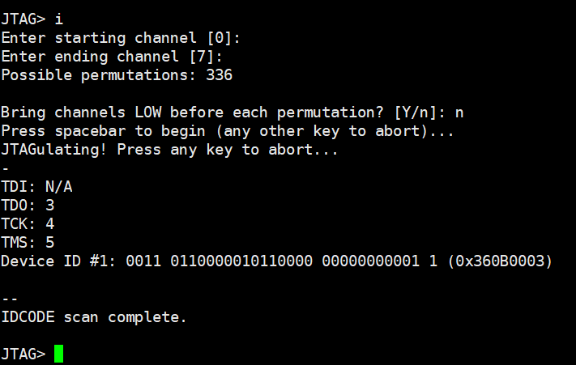
    - 专门扫描能读出 `IDCODE` 的 JTAG 接口。`IDCODE` 是 JTAG 标准中一个必选的设备标识寄存器。
    - **成功标志**：当扫描到正确的引脚组合时，会显示一个或多个32位的 `IDCODE` 值。
    - **增强固件功能**：使用 `jtagulator-ID-Tracker` 固件，会直接在 `IDCODE` 旁显示芯片制造商名称。

3.  **`B` - BYPASS 扫描**

	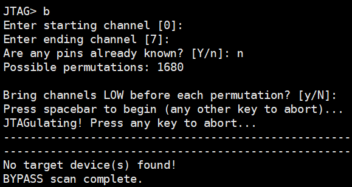
    - 尝试将链路上的所有芯片置于 `BYPASS` 模式。在此模式下，每个芯片仅作为一个1位移位寄存器。
    - **用途**：可用于判断 JTAG 链路上串联的芯片数量（通过移位数据的延迟）。

4.  **`R` - RTCK 扫描**
    - 寻找 **自适应时钟（RTCK）** 引脚。某些 ARM 内核支持此功能，目标芯片通过 RTCK 引脚反馈时钟就绪信号，调试器据此调整 TCK 频率。
    - 使用场景较少。

### 交互指令（扫描成功后使用）
1.  **`D` - 读取 IDCODE**
    - 从已识别的 JTAG 链路上读取所有芯片的 `IDCODE`。

2.  **`T` - BYPASS 测试**
    - 验证 BYPASS 模式功能，并可用于估算链路上芯片的数量。

3.  **`Y` - 指令/数据寄存器探测**
    - 尝试探测指令寄存器（IR）和数据寄存器（DR）的长度。这对于后续使用自定义指令进行深度调试至关重要。

4.  **`P` - EXTEST 测试**
    - 使用 JTAG 的 `EXTEST` 指令控制芯片的边界扫描单元，从而控制其外部引脚电平。可用于点亮LED、驱动蜂鸣器等简单验证。

5.  **`O` - 启动 OpenOCD**
    - 将 Jtagulator 配置为 **Bus Pirate** 兼容模式，并生成启动 OpenOCD 的命令。
    - **使用示例（Linux）**：
        ```bash
        # 假设扫描到的JTAG接口映射为：TMS=CH2, TCK=CH3, TDI=CH4, TDO=CH5
        # Jtagulator 会输出类似以下的命令：
        openocd -f interface/buspirate.cfg -c "transport select jtag; buspirate port /dev/ttyUSB0" -f target/stm32f1x.cfg
        ```
    - 这允许你使用强大的 OpenOCD 框架进行后续的调试、内存读写和固件提取。

---

## 0x07 UART 串口嗅探与交互

UART 是最常见的调试接口。Jtagulator 可以自动识别 TX、RX 引脚和波特率。

输入 `U` 进入 UART 模式，输入 `H` 查看指令。

### 专用指令
1.  **`U` - 完整 UART 扫描**
	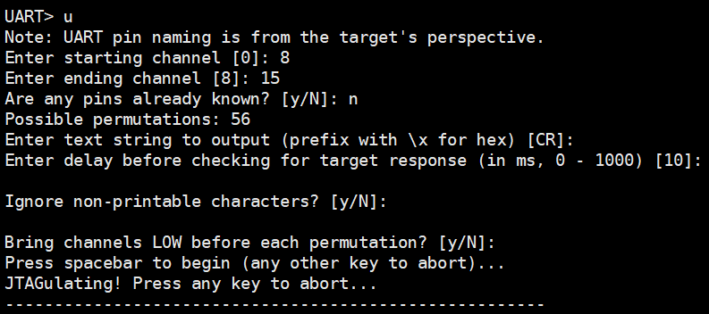
    - 在指定通道范围内，穷举所有两两组合（一个作TX，一个作RX），并尝试多种常见波特率。
	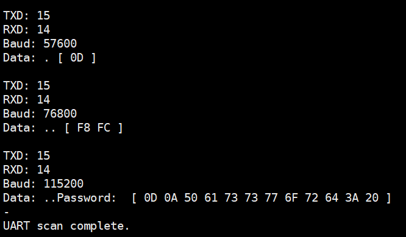
    - 需要设置一个“诱饵字符串”，默认是回车符（`\r`）。设备会发送该字符串，并监听是否有包含此字符串的回应。
    - 可以设置是否忽略不可打印字符，用于过滤纯二进制数据流。

2.  **`T` - 仅扫描 TX 引脚**
    - 持续监听所有通道，任何出现符合 UART 起始位-数据位-停止位规律的信号都会被捕获，并估计其波特率。
    - 适合用于发现“只发送”的日志输出端口。
	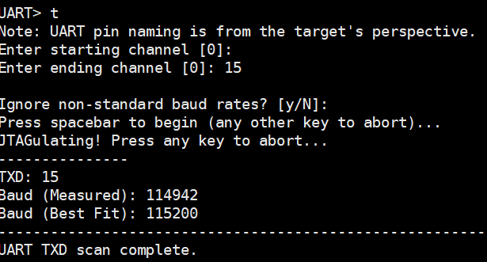

3.  **`P` - 直连通信**
    - 与已发现的 UART 接口建立双向通信。
    - 需要指定 RX、TX 通道和波特率。
	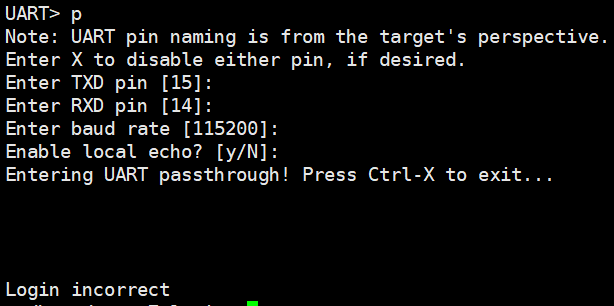
    - **本地回显（Local Echo）**：建议在与交互式终端（如Linux Shell）通信时关闭（`N`），在与单片机等需要回显验证的设备通信时开启（`Y`）。
    - **退出**：`Ctrl+X`

---

## 0x08 SWD 接口嗅探

SWD（Serial Wire Debug）是 ARM Cortex 内核常用的两线调试协议，比 JTAG 引脚更少。

输入 `S` 进入 SWD 模式，输入 `H` 查看指令。
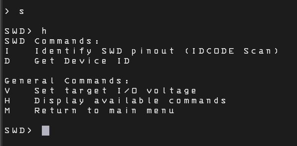
### 专用指令与硬件优化
1.  **`I` - SWD 接口扫描**
    - 扫描 SWDIO 和 SWCLK 引脚。由于 SWD 协议对时序和信号完整性要求较高，原版 Jtagulator 串联的电阻（~470Ω）可能导致扫描失败率上升。
    - **硬件优化建议**：将 I/O 口上的串联电阻（R1-R24）更换为更小的阻值（如 22Ω - 100Ω），可显著提高 SWD 扫描成功率，且对 JTAG 功能影响甚微。

2.  **`D` - 读取 SWD ID**
    - 从已识别的 SWD 接口读取目标芯片的调试访问端口（DP）ID。
    - **增强固件功能**：使用 `jtagulator-ID-Tracker` 固件，可尝试根据 ID 反推制造商。
    - **注意**：许多芯片公司使用 ARM 提供的 Cortex 内核，其 SWD-ID 中的制造商字段可能仍显示为“ARM”，而非芯片公司本身（如某些 STM32 型号）。

---

## 0x09 常见故障排解

1.  **设备无响应**：
    - **首要尝试**：在串口终端中按下 `Ctrl+X`。设备可能处于逻辑分析仪或 OpenOCD 等挂起模式，此快捷键可强制退回主界面。
    - 检查 USB 线是否连接牢固，检查数据线是否带数据传输功能，尝试更换 USB 数据线或电脑。
    - 检查串口终端软件的波特率是否正确设置为 `115200`。

2.  **扫描无结果**：
    - **确认电平**：务必先使用 `V` 指令设置正确的通信电平，并使用示波器验证。
    - **检查连接**：确保 GND 可靠连接，信号线接触良好。
    - **尝试不同模式**：JTAG 扫描可依次尝试 `J`、`I`、`B` 指令。
    - **缩小范围**：尽可能将目标板引脚连接到连续的通道，减少组合数。
    - **硬件修改**：对于 SWD 扫描，考虑减小 I/O 串联电阻。

3.  **逻辑分析仪/PulseView 无法连接**：
    - 在 Linux 下使用 `pulseview -D` 启动，并确保选择了正确的驱动和设备。
    - 在 Windows 下，FTDI 驱动可能将设备识别为标准串口而非通用驱动，可能需要手动安装或配置 libusb 驱动，这相对复杂，因此更推荐在 Linux 下使用此功能。

---

## 0x0A 结语

Jtagulator 不仅是一个强大的开源安全工具，其本身的设计也极具参考价值。其采用的高压隔离设计、ESD保护电路和简洁的布局，体现了 Joe Grand 在硬件安全设计上的深厚功底。尽管其核心功能已定型，但通过社区的努力（如增强固件的开发）和硬件的简单改造（如调整串联电阻），仍能不断挖掘和提升其潜力，使其在硬件安全分析领域持续发挥作用。

---
*文档整理与补充：Chaoschaos1024*  
*最后更新：2025年12月*